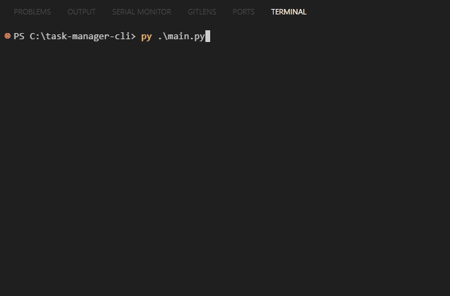

# 🗂️ Task Manager CLI

Um gerenciador de tarefas 100% feito em Python puro com interface no terminal. Projeto focado em aplicar e consolidar conhecimentos reais de programação, incluindo: organização modular com pacotes, programação orientada a objetos (POO), manipulação de arquivos JSON e boas práticas de estruturação de código.

## 📷 Demonstração


---

## 🚀 Funcionalidades

- [x] Adicionar tarefas com título, data e prioridade
- [x] Listar todas as tarefas
- [x] Marcar tarefas como concluídas
- [x] Editar título, data e prioridade de tarefas
- [x] Remover tarefas
- [x] Filtros por:
  - Status (pendente ou concluída)
  - Prioridade (1 a 5)
- [x] Salvamento automático em arquivo JSON
- [x] Menu interativo e limpo no terminal

---

## 🧱 Estrutura do Projeto
```
task_manager/
│
├── main.py                 # Ponto de entrada do sistema
├── README.md               # Este arquivo
├── requirements.txt        # (opcional) dependências futuras
│
├── data/
│   └── tasks.json          # Armazena as tarefas em JSON
│
├── lib/
│   └── task.py             # Classe Task: representa uma tarefa
│
├── system/
│   └── manager.py          # TaskManager: gerencia tarefas
│
└── interface/
    └── menu.py             # Menu de interação com o usuário (CLI)
```
---

## 🛠️ Tecnologias Utilizadas

- Python 3.10+
- Módulos padrão: os, json, datetime
- Sem bibliotecas externas (projeto totalmente standalone)

---

## 📦 Como executar o projeto

1. Clone o repositório:
```bash
git clone https://github.com/seu-usuario/task-manager-cli.git
cd task-manager-cli
```
2. Execute com Python:
```bash
python main.py
```
❗ Requisitos: Python 3 instalado e variável de ambiente configurada (python ou py no terminal)

---

## 📚 Aprendizados e Habilidades Demonstradas

• Programação orientada a objetos (POO)
• Organização real de sistemas com módulos e pacotes
• Boas práticas de escrita de código e separação de responsabilidades
• Persistência de dados com JSON
• Tratamento de erros e fluxo de execução
• Criação de interfaces de linha de comando (CLI)
• Código limpo, comentado e legível

---

## 💡 Melhorias futuras

• Ordenação por data ou prioridade
• Buscar tarefa por palavra-chave
• Interface gráfica com Tkinter ou web com Flask
• Notificações automáticas de tarefas com prazo vencido

---

## 👤 Autor

João Gabriel Luciano
🔗 [GitHub](https://github.com/jglucian0) — 🔗 [LinkedIn](https://www.linkedin.com/in/jgluciano/)
